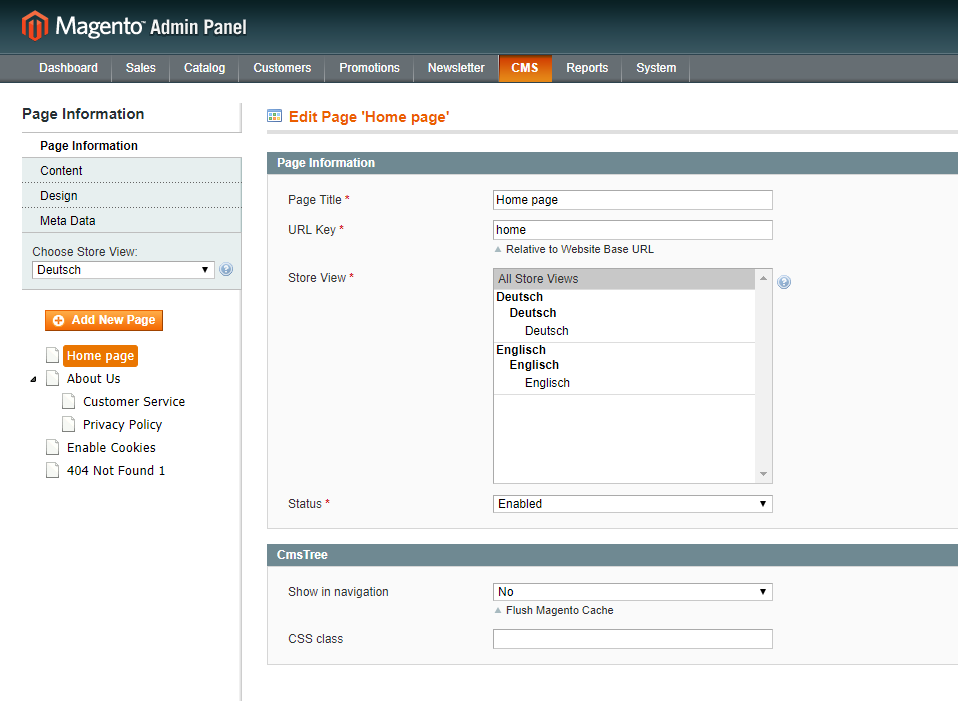
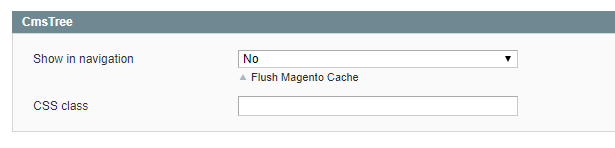
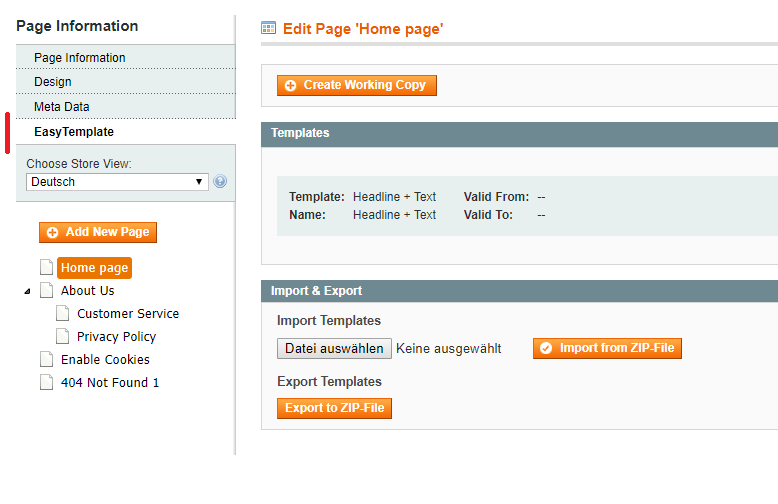

# CmsTree

---------------------------------------------------------------------------------

## Allgemein

CmsTree stellt CMS-Seiten in einer übersichtlichen Baumstruktur dar. Diese können sortiert, verschachtelt 
und bearbeitet werden. Die somit aufgebaute Struktur wird auf die Breadcrumbs übertragen. Zusätzlich
können CMS-Seiten auch in die Navigation aufgenommen werden.

### Baumstruktur

### Breadcrumbs

### Navigation

### Kompatibel mit EasyTemplate (webguys)

