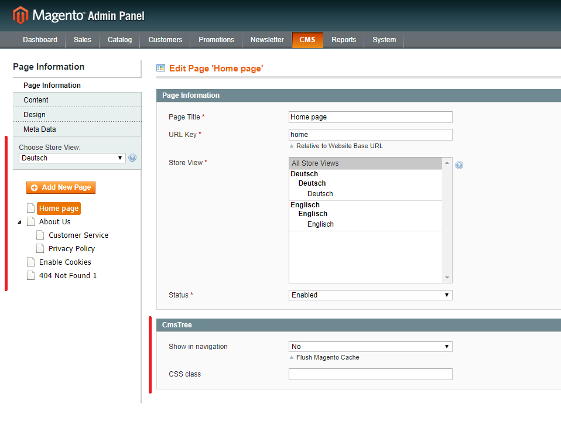

# CmsTree

CmsTree stellt CMS-Seiten in einer übersichtlichen Baumstruktur dar. Diese können sortiert, verschachtelt 
und bearbeitet werden. Gibt es mehrere Storeviews werden die CMS-Seiten gefiltert angezeigt. Die aufgebaute 
Struktur wird auf die Breadcrumbs übertragen. Zusätzlich können CMS-Seiten auch in die Navigation aufgenommen 
werden.

## Baumstruktur

## Breadcrumbs

## Navigation

## Konfiguration

## Kompatibel mit EasyTemplate (webguys)

